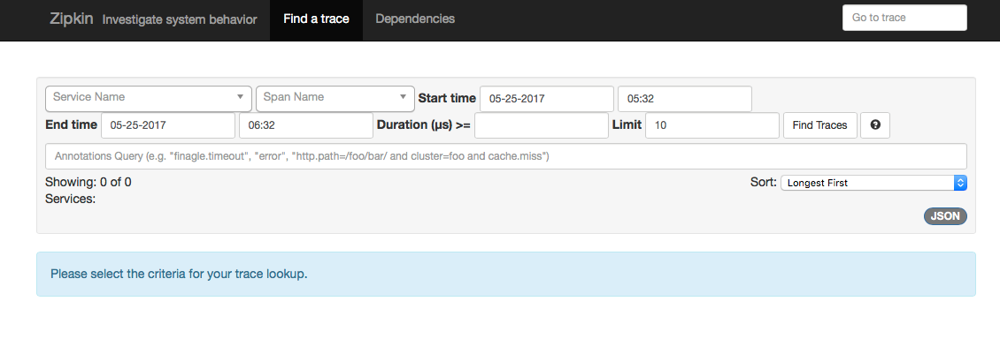
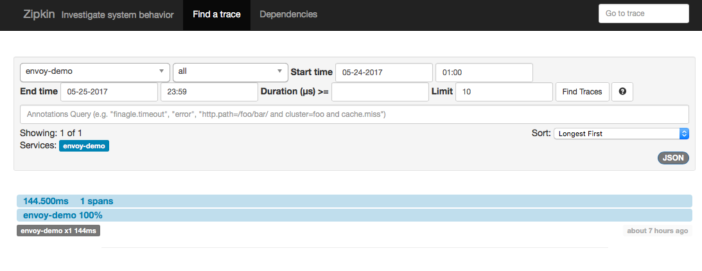
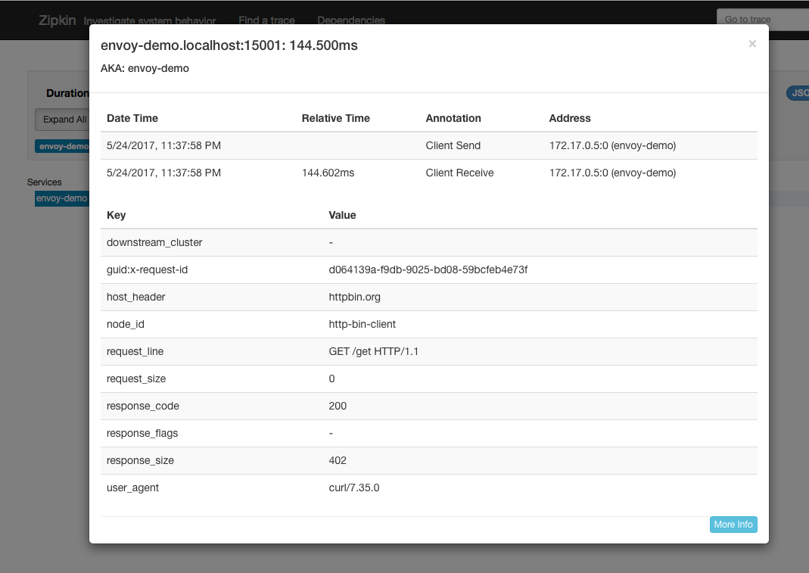

# Microservices Patterns with Envoy Proxy
... from this blog: http://blog.christianposta.com


The intention of these demos is to help a reader understand how the Envoy Proxy can be used to implement resilient microservices patterns. Each demo focuses on different Envoy Proxy configurations that can be used to implement the desired behavior.

## Overview

All of these examples are comprised of a client and a service. The client is a Java http application that simulates making http calls to the "upstream" service (note, we're using [Envoys terminology here, and throught this repo](https://lyft.github.io/envoy/docs/intro/arch_overview/terminology.html)). The client is packaged in a Docker image named `docker.io/ceposta/http-envoy-client:latest`. Alongside the http-client Java application is an instance of [Envoy Proxy](https://lyft.github.io/envoy/docs/intro/what_is_envoy.html). In this deployment model, Envoy is deployed as a [sidecar](http://blog.kubernetes.io/2015/06/the-distributed-system-toolkit-patterns.html) alongside the service (the http client in this case). When the http-client makes outbound calls (to the "upstream" service), all of the calls go through the Envoy Proxy sidecar.

The "upstream" service for these examples is [httpbin.org](http://httpbin.org). httpbin.org allows us to easily simulate HTTP service behavior. It's awesome, so check it out if you've not seen it.


To run the examples, make sure you have access to a docker daemon. If you type:

```bash
docker ps
```

You should see a response without errors.


## Running the demos

To start a demo, run the script (or do it manually) and pass in the parameters for the demo you want to run. Each demo configures the Envoy Proxy differently and may experience different behaviors. 

The format for bootstrapping a demo is:

```bash
./docker-run.sh -d <demo_name>
```

For example, to run the `circuit-breaker` demo:

```bash
./docker-run.sh -d circuit-breaker
```

You can stop the http-client's respective demos with:

```bash
./docker-stop.sh
```

The other various scripts allow us to run the http client (which will be proxied by Envoy):

* `run-http-client.sh` - runs the Java http client using environment variables specified for each demo (in each dir's `http-client.env` file
* `curl.sh` - executes a single `curl` command inside the http-client+envoy container; useful for tests that just need a single (or couple) http calls
* `get-envoy-stat.sh` - queries the Envoy Proxy's admin site for statistics that we can use to interrogate the behavior of the demo and verify it 
* `reset-envoy-stat.sh` - useful for resetting the Envoy Proxy's statistics to re-run some demos/test cases
* `port-forward-minikube.sh` useful if using minikube to expose ports locally on your host


Lastly, each demo contains a `http-client.env` file that controls the settings of the http-client we use. Example:

```json
NUM_THREADS=1
DELAY_BETWEEN_CALLS=0
NUM_CALLS_PER_CLIENT=5
URL_UNDER_TEST=http://localhost:15001/get
MIX_RESPONSE_TIMES=false
```

We can control the concurrency with `NUM_THREADS` and the duration with `NUM_CALLS_PER_CLIENT`. For example, in the above configuration, we'll use a single HTTP connection to make five successive calls with no delays between calls (note that `DELAY_BETWEEN_CALLS` is `0`). We can adjust these settings for each of the demos.


### Running the circuit-breaker demo

To run the `circuit-breaker` demo:

```bash
./docker-run.sh -d circuit-breaker
```

The Envoy configuration for circuit breakers looks like this (see the [full configuration here](./circuit-breaker/conf/envoy.json)):

```json
"circuit_breakers": {
  "default": {
    "max_connections": 1,
    "max_pending_requests": 1,
    "max_retries": 3
  }
}
```

This configuration allows us to:

* limit the number of HTTP/1 connections that we will make to the upstream clusters, short-circuiting them if we go over
* limit the number of requests to be queued/waiting for connections to become available, short-circuiting them if we go over
* limit the number of total concurrent retries at any given time (assuming a retry-policy is in place) effectively putting in place a retry quota

Let's take a look at each configuration. We'll ignore the max retry settings right now for two reasons 

1. Our settings as they are don't really make much sense; we cannot have 3 concurrent retries since we have only 1 HTTP connection allowed with 1 queued request
2. We don't actually have any retry policies in place for this demo; we can see retries in action in the `retries` demo

In any event, the retries setting here allows us to avoid large retry storms -- which in most cases can serve to compound problems when dealing with connectivity to all instances in a cluster. It's an important setting that we'll come back to with the `retries` demo.


#### max_connections

Let's see what envoy does when too many threads in an application try to make too many concurrent connections to the upstream cluster.

Recall our circuit breaking settings for our upstream `httbin` cluster looks like this (see the [full configuration here](./circuit-breaker/conf/envoy.json)):

```json
"circuit_breakers": {
  "default": {
    "max_connections": 1,
    "max_pending_requests": 1,
    "max_retries": 3
  }
}
```

If we look at the `./circuit-breaker/http-client.env` settings file, we'll see that initially we'll start by running a single thread which creates a single connection and makes five calls and shuts down:

```json
NUM_THREADS=1
DELAY_BETWEEN_CALLS=0
NUM_CALLS_PER_CLIENT=5
URL_UNDER_TEST=http://localhost:15001/get
MIX_RESPONSE_TIMES=false
```

Let's verify this. Run the demo:

```bash
./docker-run.sh -d circuit-breaker
```

This sets up the application with its client libraries and also sets up Envoy Proxy. We will send traffic directly to Envoy Proxy to handle circuit breaking for us. Let's call our service:

```bash
docker exec -it client bash -c 'java -jar http-client.jar'
```

We should see output like this:

```bash
using num threads: 1
Starting pool-1-thread-1 with numCalls=5 delayBetweenCalls=0 url=http://localhost:15001/get mixedRespTimes=false
pool-1-thread-1: successes=[5], failures=[0], duration=[545ms]
```

We can see all five of our calls succeeded!

Let's take a look at some of the metrics collected by Envoy Proxy:

```bash
./get-envoy-stats.sh
```

WOW! That's a lot of metrics Envoy tracks for us! Let's grep through that:

```bash
./get-envoy-stats.sh | grep cluster.httpbin_service
```

This will show the metrics for our configured upstream cluster named `httpbin_service`. Take a quick look through some of these statistics and [lookup their meaning in the Envoy documentation](https://lyft.github.io/envoy/docs/configuration/cluster_manager/cluster_stats.html). The important ones to note are called out here:

```bash
cluster.httpbin_service.upstream_cx_http1_total: 1
cluster.httpbin_service.upstream_rq_total: 5
cluster.httpbin_service.upstream_rq_200: 5
cluster.httpbin_service.upstream_rq_2xx: 5
cluster.httpbin_service.upstream_rq_pending_overflow: 0
cluster.httpbin_service.upstream_rq_retry: 0
```

This tells us we had 1 http/1 connection, with 5 requests (total) and 5 of them ended in HTTP `2xx` (and even `200`). Great! But what happens if we try to use two concurrent connections? 

First, let's reset the statistics:

```bash
./reset-envoy-stats.sh
OK
```

Let's invoke these calls with 2 threads:

```bash
docker exec -it client bash -c 'NUM_THREADS=2; java -jar http-client.jar'
```

We should see some output like this:

```bash
using num threads: 2
Starting pool-1-thread-1 with numCalls=5 delayBetweenCalls=0 url=http://localhost:15001/get mixedRespTimes=false
Starting pool-1-thread-2 with numCalls=5 delayBetweenCalls=0 url=http://localhost:15001/get mixedRespTimes=false
pool-1-thread-1: successes=[0], failures=[5], duration=[123ms]
pool-1-thread-2: successes=[5], failures=[0], duration=[513ms]
```

Woah.. one of our threads had 5 successes, but one of them didn't! One thread had all 5 of its requests failed! Let's take a look at the Envoy stats again:


```bash
./get-envoy-stats.sh | grep cluster.httpbin_service
```

Now our stats from above look like this:

```bash
cluster.httpbin_service.upstream_cx_http1_total: 1
cluster.httpbin_service.upstream_rq_total: 5
cluster.httpbin_service.upstream_rq_200: 5
cluster.httpbin_service.upstream_rq_2xx: 5
cluster.httpbin_service.upstream_rq_503: 5
cluster.httpbin_service.upstream_rq_5xx: 5
cluster.httpbin_service.upstream_rq_pending_overflow: 5
cluster.httpbin_service.upstream_rq_retry: 0
```

From this output we can see that only one of our connections succeeded! We ended up with 5 requests that resulted in HTTP `200` and 5 requests that ended up with HTTP `503`. We also see that `upstream_rq_pending_overflow` has been incremented to `5`. That is our indication that the circuit breaker did it's job here. It short circuited any calls that didn't match our configuration settings.

Note, we've set our `max_connections` setting to an artificially low number, `1` in this case, to illustrate Envoy's circuit breaking functionality. This is not a realistic setting but hopefully serves to illustrate the point.

#### max_pending_requests

Let's run some similar tests to exercise the `max_pending_requests` setting.

Recall our circuit breaking settings for our upstream `httbin` cluster looks like this (see the [full configuration here](./circuit-breaker/conf/envoy.json)):

```json
"circuit_breakers": {
  "default": {
    "max_connections": 1,
    "max_pending_requests": 1,
    "max_retries": 3
  }
}
```

What we want to do is simulate multiple simultaneous requests happening on a single HTTP connection (since we're only allowed `max_connections` of 1). We expect the requests to queue up, but Envoy should reject the queued up messages since we have a `max_pending_requests` set to 1. We want to set upper limits on our queue depths and not allow retry storms, rogue downstream requests, DoS, and bugs in our system to cascade. 

Continuing from the previous section, let's reset the Envoy stats:

```bash
./reset-envoy-stats.sh
OK
```


Let's invoke the client with 1 thread (ie, 1 HTTP connection) but send our requests in parallel (in batches of 5 by default). We will also want to randomize the delays we get on sends so that things can queue up:


```bash
docker exec -it client bash -c 'NUM_THREADS=1 && PARALLEL_SENDS=true && MIX_RESPONSE_TIMES=true; java -jar http-client.jar'
```

We should see output similar to this:

```bash
using num threads: 1
Starting pool-1-thread-1 with numCalls=5 parallelSends=true delayBetweenCalls=0 url=http://localhost:15001/get mixedRespTimes=true
pool-2-thread-3: using delay of : 3
pool-2-thread-2: using delay of : 0
pool-2-thread-1: using delay of : 2
pool-2-thread-4: using delay of : 4
pool-2-thread-5: using delay of : 0
finished batch 0
pool-1-thread-1: successes=[1], failures=[4], duration=[4242ms]
```

Damn! four of our requests failed... let's check the Envoy stats:


```bash
./get-envoy-stats.sh | grep cluster.httpbin_service | grep pending
```

Sure enough, we see that 4 of our requests were short circuited:

```bash
cluster.httpbin_service.upstream_rq_pending_active: 0
cluster.httpbin_service.upstream_rq_pending_failure_eject: 0
cluster.httpbin_service.upstream_rq_pending_overflow: 4
cluster.httpbin_service.upstream_rq_pending_total: 1
```

#### What about when services go down completely?

We've seen what circuit breaking facilities Envoy has for short circuiting and bulkheading threads to clusters, but what if nodes in a cluster go down (or appear to go down) completely?

Envoy [has settings for "outlier detection"](https://lyft.github.io/envoy/docs/intro/arch_overview/outlier.html) which can detect when hosts in a cluster are not reliable and can eject them from the cluster rotation completely (for a period of time). One interesting phenomenon to understand is that by default, Envoy will eject hosts from the load balancing algorithms up to a certain point. Envoy's load balancer algorithms will detect a [panic threshold](https://lyft.github.io/envoy/docs/intro/arch_overview/load_balancing.html#arch-overview-load-balancing-panic-threshold) if too many (ie, > 50%) of the hosts have been deemed unhealthy and will just go back to load balancing against all of them. This panic threshold is configurable and to get circuit breaking functionality that sheds load (for a period of time) to all hosts during a severe outage, you can configure the outlier detection settings. In our [sample circuit breaker](./circuit-breaker/conf/envoy.json)) `envoy.json` config you can see the following:

```bash
    "outlier_detection" : {
      "consecutive_5xx": 5,
      "max_ejection_percent": 100,
      "interval_ms": 3
    }
```
   
Let's test this case and see what happens. First, reset the stats:
    
    
```bash
./reset-envoy-stats.sh
OK
```    

Next, let's call our client with a URL that will give us back HTTP `500` results. We'll make 10 calls because our outlier detection will check for 5 consecutive 5xx responses, so we'll want to do more that 5 calls.
   
```bash
docker exec -it client bash -c 'URL_UNDER_TEST=http://localhost:15001/status/500 && NUM_CALLS_PER_CLIENT=10; java -jar http-client.jar'
```   

We should see a response like this where all the calls failed (as we expect: at least 5 of them would have gotten back HTTP 500):

```bash
using num threads: 1
Starting pool-1-thread-1 with numCalls=10 parallelSends=false delayBetweenCalls=0 url=http://localhost:15001/status/500 mixedRespTimes=false
pool-1-thread-1: successes=[0], failures=[10], duration=[929ms]
```

Let's now check the Envoy stats to see what happened exactly:

```bash
./get-envoy-stats.sh | grep cluster.httpbin_service | grep outlier
```

```bash
cluster.httpbin_service.outlier_detection.ejections_active: 0
cluster.httpbin_service.outlier_detection.ejections_consecutive_5xx: 1
cluster.httpbin_service.outlier_detection.ejections_overflow: 0
cluster.httpbin_service.outlier_detection.ejections_success_rate: 0
cluster.httpbin_service.outlier_detection.ejections_total: 1
```

We can see we tripped the consecutive 5xx detection! We've also removed that host from our loadbalancing group. 

### Running the retries demo

For the retries demo, we'll be configuring our routing in Envoy like this:

```json
  "routes": [
    {
      "timeout_ms": 0,
      "prefix": "/",
      "auto_host_rewrite": true,
      "cluster": "httpbin_service",
      "retry_policy": {
        "retry_on": "5xx",
        "num_retries": 3
      }

    }
```

Here we're saying to retry up to 3 times on HTTP status of 5xx.

If you've run previous demos, please make sure to get a clean start for this (or any) demo. We have different Envoy configurations for each demo and want to make sure we start from a clean slate each time.

First stop any existing demos:

```bash
./docker-stop.sh
```

Now let's get our `retries` demo up:

```bash
./docker-run.sh -d retries
```

Now let's exercise the client with a *single* call which will hit an HTTP endpoint that should return an HTTP `500` error. We'll use the `curl.sh` script which is set up to call curl inside our demo container. 

```bash
./curl.sh -vvvv localhost:15001/status/500
```

We should see something like this:

```bash
* Hostname was NOT found in DNS cache
*   Trying ::1...
* connect to ::1 port 15001 failed: Connection refused
*   Trying 127.0.0.1...
* Connected to localhost (127.0.0.1) port 15001 (#0)
> GET /status/500 HTTP/1.1
> User-Agent: curl/7.35.0
> Host: localhost:15001
> Accept: */*
> 
< HTTP/1.1 500 Internal Server Error
* Server envoy is not blacklisted
< server: envoy
< date: Thu, 25 May 2017 05:55:37 GMT
< content-type: text/html; charset=utf-8
< access-control-allow-origin: *
< access-control-allow-credentials: true
< x-powered-by: Flask
< x-processed-time: 0.000718116760254
< content-length: 0
< via: 1.1 vegur
< x-envoy-upstream-service-time: 684
< 
* Connection #0 to host localhost left intact
```

Great! Now, let's check what Envoy has done for us:

```bash
./get-envoy-stats.sh | grep retry
```

```bash
cluster.httpbin_service.retry.upstream_rq_500: 3
cluster.httpbin_service.retry.upstream_rq_5xx: 3
cluster.httpbin_service.upstream_rq_retry: 3
cluster.httpbin_service.upstream_rq_retry_overflow: 0
cluster.httpbin_service.upstream_rq_retry_success: 0
```

Yay! We see here that envoy has retried 3 times because of HTTP `500` errors.

Some things to keep in mind about retries:

* Envoy will do automatic exponential retry with jittering. See [the docs for more](https://lyft.github.io/envoy/docs/configuration/http_filters/router_filter.html)
* You can set retry timeouts (timeout for each retry), but the overall route timeout (configured for the routing table; see the `timeouts` demo for the exact configuration) will still hold/apply; this is to short circuit any run away retry/exponential backoff 
* You should always set the circuit breaker retry configuration to limit the amount of quota for retries when you may have large numbers of connections. See the [active retries in the circuit breaker section in the Envoy documentation](https://lyft.github.io/envoy/docs/intro/arch_overview/circuit_breaking.html#arch-overview-circuit-break)

### Running the timeouts demo

For the timeouts demo, we'll be configuring our routing in Envoy like this:

```json
  "routes": [
    {
      "timeout_ms": 0,
      "prefix": "/",
      "auto_host_rewrite": true,
      "cluster": "httpbin_service",
      "timeout_ms": 3000
    }
```

This configuration is setting a global (ie, includes all retries) 3s timeout for any calls made through this route to the `httpbin_service` cluster.

If you've run previous demos, please make sure to get a clean start for this (or any) demo. We have different Envoy configurations for each demo and want to make sure we start from a clean slate each time.

First stop any existing demos:

```bash
./docker-stop.sh
```

Now let's get our `timeouts` demo up:

```bash
./docker-run.sh -d timeouts
```

Now let's exercise the client with a *single* call which will hit an HTTP endpoint that should delay the response by about 5s. This delay should be enough to trigger the envoy timeout. We'll use the `curl.sh` script which is set up to call curl inside our demo container. 

```bash
./curl.sh -vvvv localhost:15001/delay/5
```

We should see output similar to this:

```bash
* Hostname was NOT found in DNS cache
*   Trying ::1...
* connect to ::1 port 15001 failed: Connection refused
*   Trying 127.0.0.1...
* Connected to localhost (127.0.0.1) port 15001 (#0)
> GET /delay/5 HTTP/1.1
> User-Agent: curl/7.35.0
> Host: localhost:15001
> Accept: */*
> 
< HTTP/1.1 504 Gateway Timeout
< content-length: 24
< content-type: text/plain
< date: Thu, 25 May 2017 06:13:53 GMT
* Server envoy is not blacklisted
< server: envoy
< 
* Connection #0 to host localhost left intact
upstream request timeout
```

We see that our request was timed out!

Let's check the Envoy stats:

```bash
./get-envoy-stats.sh | grep timeout
```

Here we see 1 request (the one we sent in!) was timed out by Envoy.

```bash
cluster.httpbin_service.upstream_cx_connect_timeout: 0
cluster.httpbin_service.upstream_rq_per_try_timeout: 0
cluster.httpbin_service.upstream_rq_timeout: 1
http.admin.downstream_cx_idle_timeout: 0
http.egress_http.downstream_cx_idle_timeout: 0
```

If we send the request in, this time with a smaller delay, we should see the call go through:

```bash
./curl.sh -vvvv localhost:15001/delay/2
```

```bash
* Hostname was NOT found in DNS cache
*   Trying ::1...
* connect to ::1 port 15001 failed: Connection refused
*   Trying 127.0.0.1...
* Connected to localhost (127.0.0.1) port 15001 (#0)
> GET /delay/2 HTTP/1.1
> User-Agent: curl/7.35.0
> Host: localhost:15001
> Accept: */*
> 
< HTTP/1.1 200 OK
* Server envoy is not blacklisted
< server: envoy
< date: Thu, 25 May 2017 06:15:41 GMT
< content-type: application/json
< access-control-allow-origin: *
< access-control-allow-credentials: true
< x-powered-by: Flask
< x-processed-time: 2.00246119499
< content-length: 309
< via: 1.1 vegur
< x-envoy-upstream-service-time: 2145
< 
{
  "args": {}, 
  "data": "", 
  "files": {}, 
  "form": {}, 
  "headers": {
    "Accept": "*/*", 
    "Connection": "close", 
    "Host": "httpbin.org", 
    "User-Agent": "curl/7.35.0", 
    "X-Envoy-Expected-Rq-Timeout-Ms": "3000"
  }, 
  "origin": "68.3.84.124", 
  "url": "http://httpbin.org/delay/2"
}
* Connection #0 to host localhost left intact
```

Also note that Envoy propagates the timeout headers so that upstream services have an idea about what to expect.

### Running the tracing demo

For the tracing demo, we'll be configuring our Envoy with the following salient config ([see the full config for the rest of the context](./tracing/conf/envoy.json):

```json
    "tracing": {
      "operation_name": "egress"
    },
    
    ...
    
      "tracing": {
        "http": {
          "driver": {
            "type": "zipkin",
            "config": {
              "collector_cluster": "zipkin",
              "collector_endpoint": "/api/v1/spans"
            }
          }
        }
      },
      
      ...
      
       {
          "name": "zipkin",
          "connect_timeout_ms": 1000,
          "type": "strict_dns",
          "lb_type": "round_robin",
          "hosts": [
            {
              "url": "tcp://zipkin:9411"
            }
          ]
        }
    
```

Here we're configuring our tracing driver and tracing cluster. In this case, to run this demo, we'll need to start up a Zipkin server:

First stop any existing demos:

```bash
./docker-stop.sh
```

Then bootstrap our zipkin server:

```bash
./tracing/docker-run-zipkin.sh
```

This will expose zipkin onto ports `9411`. If you're using minikube or something similar to run these demos, you can directly export the minikube port to your host like this:
 
```bash
./port-forward-minikube.sh 9411
``` 

Check out that command to port it to whatever your docker host may look like. Once you've gotten Zipkin up and running, navigate to the service (ie, on minikube, after doing the port forwarding, it would just be http://localhost:9411). You should see Zipkin:



Now that we've got our zipkin server up, let's start up our `tracing` demo:

```bash
./docker-run.sh -d tracing
```

Let's send some traffic through our client:

```bash
./curl.sh -vvvv localhost:15001/get
```

We should get a response that looks like this:

```bash
< HTTP/1.1 200 OK
* Server envoy is not blacklisted
< server: envoy
< date: Thu, 25 May 2017 06:31:02 GMT
< content-type: application/json
< access-control-allow-origin: *
< access-control-allow-credentials: true
< x-powered-by: Flask
< x-processed-time: 0.000982999801636
< content-length: 402
< via: 1.1 vegur
< x-envoy-upstream-service-time: 142
< 
{
  "args": {}, 
  "headers": {
    "Accept": "*/*", 
    "Connection": "close", 
    "Host": "httpbin.org", 
    "User-Agent": "curl/7.35.0", 
    "X-B3-Sampled": "1", 
    "X-B3-Spanid": "0000b825f82b418d", 
    "X-B3-Traceid": "0000b825f82b418d", 
    "X-Ot-Span-Context": "0000b825f82b418d;0000b825f82b418d;0000000000000000;cs"
  }, 
  "origin": "68.3.84.124", 
  "url": "http://httpbin.org/get"
}
```

Now if we go to our Zipkin server, we should see a single span/trace for this call (note, you may have to adjust the start/stop times in the zipkin filter:



Here we have a single trace that has a single span (which is what we expect since our demo client which has Envoy is talking directly to an external service that does not have Envoy... if the upstream service also had Envoy with zipkin enabled, we'd see the full set of spans between services)

If we click into the span to see more detail, we'd see something like this:

